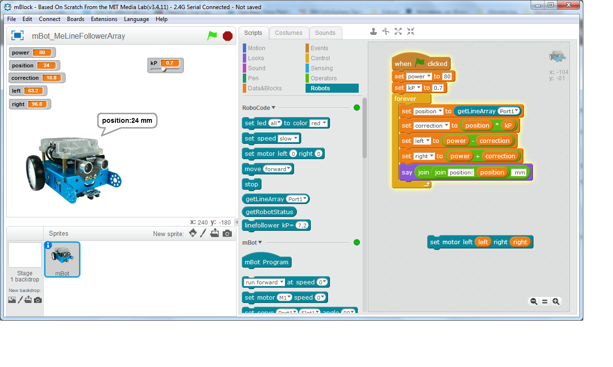

* Goal: Makeblock mBot robot as a platform for teaching technology, programming and robotics at school.
* Aproach: Provide a user friendly interface to a robot that moves reliable and semi-autonomous.
The robot can perfom tasks as a clerk in a warehouse driving around, picking up goods and delivering them.

For progress check out [projects](https://github.com/Tauvic/Technology-at-school/projects)

* Easy robot programming
  * RoboCode Basic (a robot that can do basic line following with a 6 sensor line sensor array)
  * RoboCode Advanced (semi-autonomous line following, detect road crossings, drives with a PID controller)
  * RoboGrip (manus roboticus, includes a gripper hand)
  * RoboVision (visis roboticus)
* Improve editor
  * Snap4Arduino https://snap.berkeley.edu/SnapManual.pdf
  * http://www.snap-apps.org/
* Sensors
  * Line following array
  * NXP FXAS21002C Gyroscope
  * Energy management battery voltage / current http://www.vwlowen.co.uk/arduino/current/current.htm
  * Color sensor http://forum.makeblock.com/t/extension-for-color-sensor-tcs-34725/7331/23
* Actuators
  * Gripper http://forum.makeblock.com/t/mcore-robotic-arm-gripper/5821/4
  * Better control over motor
    * https://www.precisionmicrodrives.com/application-notes/ab-026-sensorless-speed-stabiliser-for-a-dc-motor
    * https://www.precisionmicrodrives.com/application-notes/ab-021-measuring-rpm-from-back-emf
    * https://robidouille.wordpress.com/2009/09/20/back-emf/
    * https://arduino-info.wikispaces.com/SmallSteppers

