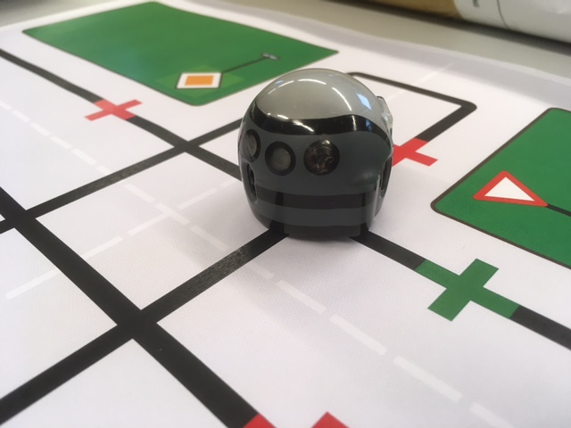

Start your journey with the easy to use [Ozobot](./Ozobot) and then continue with the more technicaly challenging types such as the [mBot](./Makeblock). For those who do not have a robot can save money on batteries by using a simulated robot in V-REP.

Robots:
* [Ozobot](./Ozobot) basic robot (for children 4-7 years) with predefined moves and programming
* [Makeblock](./Makeblock) mBot robot with basic to advanced programming
* [V-REP](./V-REP) 3D world and robot simulator

Also see:
* my blog: https://tauvicr.wordpress.com/tag/robotics/
* mBot simulation by NenadZG: https://github.com/NenadZG/mBot-simulation
* [Poppy](https://www.poppy-project.org/en/) advanced robot (Ergo Jr, Poppy Torso and Humanoid)
