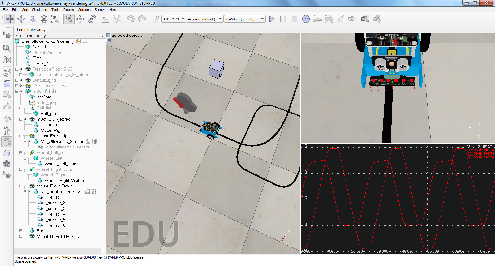

>The robot simulator V-REP, with integrated development environment, is based on a distributed control architecture: each object/model can be individually controlled via an embedded script, a plugin, a ROS node, a remote API client, or a custom solution. This makes V-REP very versatile and ideal for multi-robot applications. Controllers can be written in C/C++, Python, Java, Lua, Matlab or Octave.

Here iprovide a V-REP simulation of a Makeblock mBot with a 6 sensor line following array. I use this model to find out how to design a line following robot. I'm aiming for a base robot model that can be extended with add-on components. The model has initially been developed by Nenad Stajić (https://github.com/NenadZG/mBot-simulation). Check out his site for detailed instruction how to setup and use the V-REP simulator.

The base model has a frame, the computer, batteries but excludes sensors and motors. It provides mounting points for sensors and motors. Then a library of these components can be developed over time to mimic existing components and new experimental sensors. The components will also car their own code scripts and exchange information with the robot just as library functions would do. This approach will make it easy to develop clean code and keep the model simple.

For now the model supports the Orion protocol, but it could be made to also support Firmata. The model now assumes and supports only one robot in the scene , but i like two have at least two robots to see how they can interact. The interaction with shared variables or tubes should have some naming convention that includes a robot name.

https://www.youtube.com/watch?v=SsckRdH894I
